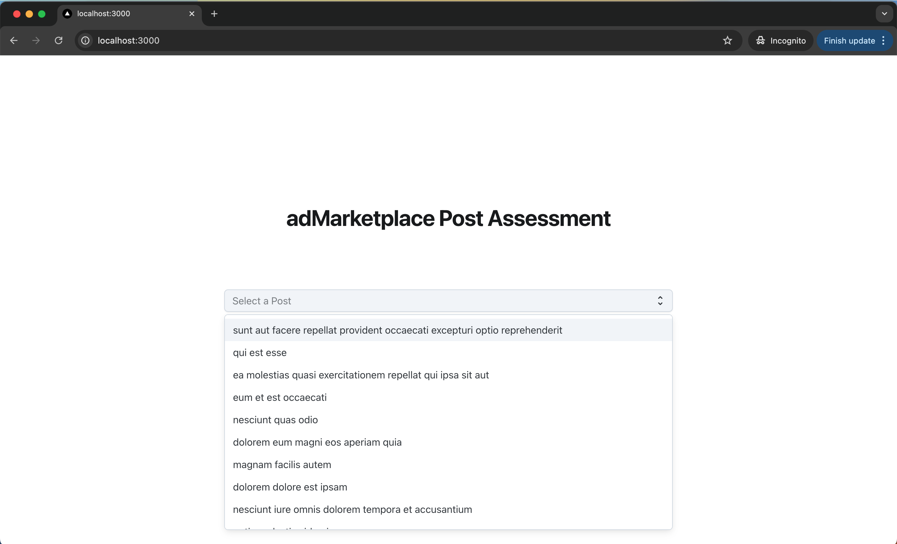
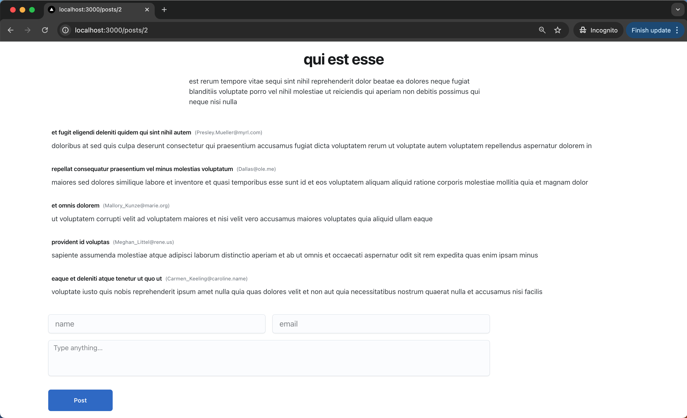
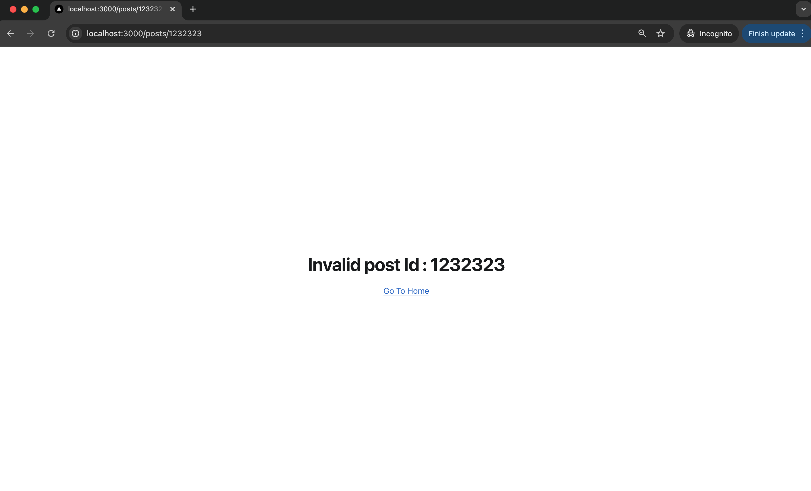
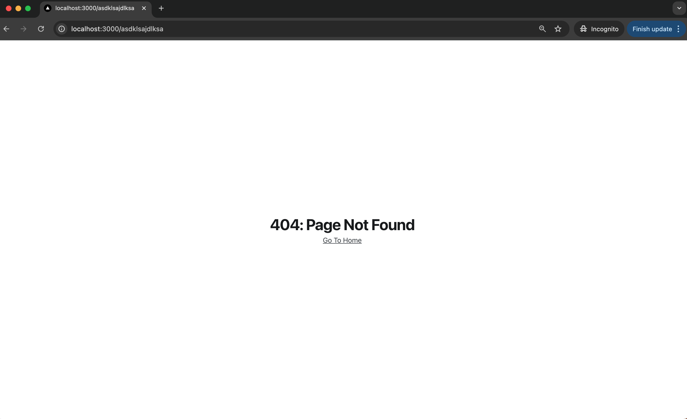
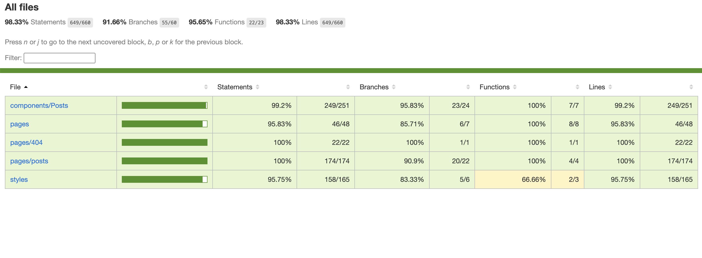

This is a [Next.js](https://nextjs.org/) project

## adMarketplace - Frontend Test

First, install the requred node packages:

```bash
npm install
```

Second, run the development server:

```bash
npm run dev
```

Open [http://localhost:3000](http://localhost:3000) with your browser to see the result.

## View 1



## View 2



## View 3



## View 4



## test


